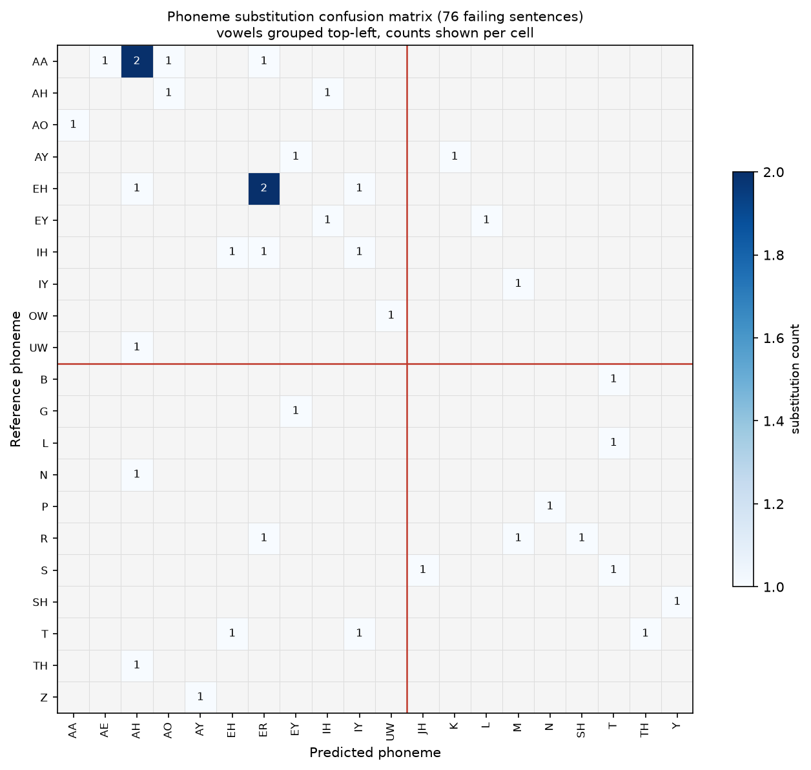

# Error pattern analysis: phoneme-to-text decoder

Project: homophone-aware phoneme-to-text decoding for lip-reading
Date: 22 July 2026
Model: Llama-3.2-3B with low-rank adapters, trained on clean phonemes
Decoding: beam search width 5
Evaluation set: 949 validation sentences, deduplicated against training

Structured to follow the P2T Three-Stage Error Analysis Framework.

## Scope

This report analyses the errors remaining after fine-tuning the decoder on clean
phoneme transcriptions. The model gets 873 of 949 sentences exactly right and
fails on 76. A second model, trained on the same data but with some of its input
phonemes deliberately corrupted, is analysed in a separate report; no number here
refers to it.

Two framework activities fall outside what this component can be measured on.
Viseme analysis asks which sounds look alike on the lips, which is a property of
the visual front-end upstream of us. Our decoder receives phonemes already
transcribed and produces text, so a viseme grouping explains none of its errors.
Severity assessment is included below at category level, though a fully
defensible version would annotate all 76 failures individually.

The failure sample is 76 rows. Several breakdowns rest on counts in single
digits, and those are flagged where they occur.

## Stage 1: Conventional evaluation

Alignment is by Levenshtein distance at word, character and phoneme level.

| Metric | Value |
|---|---|
| Phoneme error rate | 1.75% |
| Word error rate | 2.09% |
| Character error rate | 0.98% |
| Exact sentence match | 91.99% |

Phoneme error rate on failing rows alone rises to 19.26%, against 0% on the 873
correct rows.

As the framework sets out, these numbers say how much and stay silent on what.
Two models with identical phoneme error rates can fail in entirely different
ways, and the remaining stages exist to separate those cases.

## Stage 2: Phoneme error pattern analysis

### Substitution, insertion and deletion

| Level | Reference units | Substitutions | Insertions | Deletions | Error rate |
|---|---|---|---|---|---|
| Word, overall | 5,214 | 87 | 13 | 11 | 2.13% |
| Word, homophone rows | 3,995 | 57 | 8 | 9 | 1.85% |
| Word, non-homophone rows | 1,219 | 30 | 5 | 2 | 3.04% |
| Character, overall | 26,345 | 116 | 67 | 78 | 0.99% |
| Character, homophone rows | 19,751 | 74 | 35 | 60 | 0.86% |
| Character, non-homophone rows | 6,594 | 42 | 32 | 18 | 1.40% |

At word level, 87 of 111 errors are substitutions (78%). The dominant behaviour
is picking the wrong word while keeping sentence structure intact.

At character level the balance flips. Insertions and deletions total 145 against
116 substitutions, and 95 of those 145 sit in homophone rows. That signature
comes from splitting or merging a word, which forces the character alignment to
insert or delete a space and shifts everything after it.

Non-homophone sentences score worse on every line. This runs against the
expectation that homophones are the harder case, and it has now appeared in four
consecutive runs. We have no explanation and are treating it as open.

### Confusion matrix

A confusion matrix records, for every sound the model got wrong, which sound it
produced instead. Reference sounds run down the rows and predicted sounds across
the columns, so each filled cell is one type of substitution and its number is
how often that substitution happened. The figure below covers the 76 failing
sentences, with vowels grouped in the upper-left block and consonants in the
lower-right, separated by the red lines.

The matrix holds 38 substitutions spread across 36 distinct cells. Only two cells
reach a count of two, AA replaced by AH and EH replaced by ER. Every other cell
holds a single event. Thirty-six distinct confusions from 38 substitutions means
the errors do not repeat: the model does not confuse one particular sound for
another in a consistent way that could be corrected with a targeted rule. The
sample is small enough that a systematic pattern could still emerge at larger
scale, so this describes the current data without ruling that out.

The density sits in the upper-left block, where a vowel was replaced by another
vowel. That accounts for 19 of the 38 substitutions, exactly half, and is the
clearest signal in the analysis that the model's weak point is vowel quality
rather than consonants. This proportion does not depend on how often each sound
appears, so it is more stable than the per-sound rates below. Six substitutions
replace a consonant with a vowel and three replace a vowel with a consonant, and
the rest stay within the consonants.

For completeness: an earlier version of this matrix was computed incorrectly. It
joined each phoneme sequence into one unbroken string before aligning, which made
it compare individual letters and produce meaningless pairs such as the letter A
against the letter E. That computation has been replaced by the sound-level
matrix shown here, and any earlier figure built from it should be disregarded.

### Phoneme-class analysis

The table below counts, for each reference sound, how many times it was
substituted and how often it appears across all 949 sentences, giving a
corpus-wide error rate in the same form as the parallel prompting study. Sounds
are ordered by substitution count, since that is the more stable ordering at
these low error volumes.

| Sound | Substitutions | Occurrences across 949 sentences | Rate | Replacements seen |
|---|---|---|---|---|
| AA (as in "father") | 5 | 379 | 1.3% | AH, AE, AO, ER |
| EH (as in "bed") | 4 | 519 | 0.8% | ER, AH, IY |
| R | 3 | 829 | 0.4% | ER, M, SH |
| IH (as in "sit") | 3 | 1,138 | 0.3% | EH, ER, IY |
| T | 3 | 1,540 | 0.2% | EH, IY, TH |
| EY (as in "say") | 2 | 263 | 0.8% | IH, L |
| AY (as in "my") | 2 | 407 | 0.5% | EY, K |
| AH (as in "cup") | 2 | 1,702 | 0.1% | AO, IH |

Every rate sits below 1.4%, which is expected for a model that gets 92% of
sentences exactly right. The two sounds substituted most often are the vowels AA
and EH, and both are open or open-mid, meaning the jaw sits low when they are
produced. This is consistent with the vowel-to-vowel pattern in the confusion
matrix above, which is the stronger evidence since it does not depend on
occurrence counts.

Read as a rate alone, this table is noisy at these volumes. A sound substituted
once can show a higher rate than AA purely because it is rare: TH, for instance,
appears 64 times with one substitution, giving a 1.6% rate off a single event.
The substitution count is the reliable column; the rate is context for it.

The replacement column shows the same dispersion as the matrix. AA is replaced by
four different vowels across its five substitutions, and EH by three across its
four, so where a sound fails more than once it tends to fail in a different
direction each time.

Grouping substitutions by articulatory feature, where place is where in the
mouth a sound forms, manner is how it is produced, and voicing is whether the
vocal cords vibrate:

| Group | Substitutions | Place kept | Manner kept | Voicing kept |
|---|---|---|---|---|
| All failing rows | 38 | 44.7% | 47.4% | 26.3% |
| Homophone rows | 27 | 51.9% | 51.9% | 25.9% |
| Non-homophone rows | 11 | 27.3% | 36.4% | 27.3% |

Voicing is preserved least often at 26%, which suggests voicing errors tend to
miss by a full articulatory step. Homophone rows preserve place and manner about
half the time while non-homophone rows preserve them less often, which is
consistent with errors in homophone sentences being closer to the target than
errors elsewhere. The non-homophone figures rest on 11 substitutions, so this
difference is suggestive rather than established.

### Are the errors systematic?

The framework distinguishes systematic confusions, which suggest a targeted fix,
from random ones, which are harder to diagnose. Weighting the phoneme error rate
by articulatory similarity answers this: a weighted rate far below the
unweighted one would mean errors clustered among neighbouring sounds.

| Group | n | Phoneme error rate | Weighted | Ratio |
|---|---|---|---|---|
| Overall | 949 | 1.75% | 1.63% | 0.930 |
| Homophone rows | 672 | 1.48% | 1.37% | 0.928 |
| Non-homophone rows | 277 | 2.52% | 2.36% | 0.935 |
| Failing rows only | 76 | 19.26% | 17.92% | 0.930 |

The ratio holds at 0.93 across every group. Weighting by articulatory similarity
moves the total by 7%, which points toward errors that are not concentrated
among neighbouring sounds. The confusion matrix points the same way, with 36
distinct pairs from 38 events. The two measurements are consistent with each
other, though both rest on the same small set of substitutions and are not fully
independent evidence. The parallel prompting-based study on this same corpus,
run by another member of the group, reported the weighted rate well below the
unweighted one, which would indicate clustered errors; the difference from our
result may reflect the different approach, the far larger error count in that
study, or both. On our data a sound-aware rescoring pass would have limited
material to work with.

The AA to AH confusion illustrates why. Those two vowels share place and manner,
so a correction working from articulatory features cannot separate them. Only
length distinguishes them, and length is the dimension the model loses.

## Stage 3: Hierarchical error analysis

Each failing sentence was classified using the target text, the predicted text,
and pronunciation dictionary lookups for both. Methodology follows the
framework's Option 2 for lexical analysis and Option 3 for contextual analysis,
with semantic similarity scoring for Option 4. Option 5, classification by a
language model, is built but has not been run.

### 3.1 Lexical analysis

All four lexical error types named in the framework appear in our output.

| Framework type | Our category | n | Share | Example |
|---|---|---|---|---|
| Homophone ambiguity | Homophone substitution | 34 | 44.7% | PINT to PAINT |
| Incorrect word selection | Semantic substitution | 8 | 10.5% | RARITY to RETIREMENT |
| Out of vocabulary | Invented spelling | 17 | 22.4% | SQUIRREL to SQUWAREL |
| Out of vocabulary | Rare word substitution | 3 | 3.9% | SAXIFRAGE to SAXOPHONE FRAGMENT |
| Incorrect segmentation | Word boundary error | 5 | 6.6% | ROPES to ROPE S |
| Beyond framework | Number formatting | 5 | 6.6% | SIX to 6 |
| Beyond framework | Truncation | 3 | 3.9% | final word dropped |
| Beyond framework | Suffix addition | 1 | 1.3% | SHIP to SHIPPING |

Homophone and incorrect-word-selection cases are two ends of one phenomenon and
together account for 42 of 76 failures (55%). Which of the two a case lands in
depends on a similarity threshold with no principled value.

Dictionary coverage supports the out-of-vocabulary reading: 56 predictions
contain a word the pronunciation dictionary lacks against 34 in the targets, so
the model invents unknown words more often than it meets them. Nothing
constrains the decoder to produce real words.

**Reliability of these labels.** The categories in the table above were assigned
by an automatic rule. To check that rule, one of us read 26 of the 76 failing
sentences by hand, without seeing the automatic label, and assigned a category
independently. This manual review is referred to as the manual audit throughout
this report. The two labels disagreed on twelve of the 26 sentences, which is
46%.

The disagreements run in one direction: the automatic rule over-assigns
homophone ambiguity, because its test of whether two words share half their
sounds catches cases that are homophones in no linguistic sense. FORTNIGHT
becoming NIGHT is a dropped syllable, OLYMPIC becoming OLYMPICS is an added
plural, FLOURISH becoming FLURRY is a collapsed syllable. Three further cases the
rule labelled invented spellings or incorrect word selection were word
segmentation problems underneath. Genuine homophone ambiguity therefore sits
below the 44.7% in the table and segmentation well above its 6.6%. This is the
framework's own argument for manual annotation as the most defensible option, and
the audit here is a partial version of it, covering 26 of the 76 failures rather
than all of them.

### 3.2 Contextual analysis

The grammar checker looks for tense inconsistency, agreement errors and
word-order problems, specifically flagging cases where a possessive word such as
THEIR or YOUR appears in a position only its sound-alike counterpart could fill.

It fired zero times across all 85 substitutions.

The four genuine homophone substitutions in the whole evaluation set are TO for
TOO, AD for ADD, BY for BUY, and LLOYD for LOYD. None involves a possessive
pronoun, so the detector had nothing to catch. It works and should stay armed
for larger runs; this corpus lacks the confusion it targets. The other 81
substitutions fall outside exact-homophone lookup and are the segmentation,
suffix and dictionary-coverage problems described above.

The detector found no contextual errors of the framework's type in this output.
This reflects both the model producing mostly well-formed sentences and the
detector covering only the closed-class possessive case, so it should be read as
an absence of that specific error type rather than a guarantee of full
grammaticality.

### 3.3 Semantic analysis

Semantic similarity was measured with the framework's Option 4 method, sentence
embeddings, which encode each sentence to a single vector and take the cosine
between target and prediction. Two sentences can score highly even when their
words differ. Measured on the 76 failing rows:

| Statistic | Value |
|---|---|
| Mean | 0.662 |
| Median | 0.648 |
| Scoring 0.90 or above | 18 of 76 (23.7%) |
| Scoring 0.70 or above | 32 of 76 (42.1%) |
| Scoring below 0.50 | 17 of 76 (22.4%) |

About a fifth of failures fall below 0.50, which are genuine meaning losses. The
lowest scores are cases where a key content word changed and the sentence meaning
collapsed, and the highest are the formatting and grammatical cases where meaning
survives (SIX becoming 6, an article insertion). Homophone-row failures preserve
meaning slightly better than non-homophone ones, at 0.680 against 0.626, which
matches the phoneme-level finding that non-homophone errors land further from the
target.

This report first measured semantics with a token-level method (BERTScore), which
reported a mean of 0.884 and no failures below 0.50, so meaning looked fully
preserved. The framework's own caution about Option 4 is that a similarity score
can stay high while meaning changes, and that is exactly what the token-level
method did here by rewarding word overlap. The sentence-embedding method above
catches the meaning losses the token-level score missed, so it is the reading this
report relies on.

### 3.4 Severity assessment

Severity is assigned by meaning impact, using the per-row sentence-embedding
scores, since the framework defines severity by consequence and a semantic score
measures exactly that. Bands: Low is a score at or above 0.90 (meaning preserved),
Medium is 0.70 to 0.90 (minor drift), High is 0.50 to 0.70 (substantial change),
and meaning-lost is below 0.50.

| Severity | Rows | Share |
|---|---|---|
| Low | 18 | 23.7% |
| Medium | 14 | 18.4% |
| High | 27 | 35.5% |
| Meaning lost | 17 | 22.4% |

More than half of the failures carry substantial meaning change or worse. Low
covers cases where meaning survives intact and a reader recovers the intended text
without effort, such as SIX rendered as 6. High covers substantial meaning change,
such as RARITY becoming RETIREMENT, and the meaning-lost band holds the cases where
a content word changed and the sentence no longer means what it should.

An earlier version of this section assigned severity per error category by a rule,
which put most failures at Low or Medium. That was too lenient: it inherited the
token-level semantic method's overstatement of meaning preservation. Reading
severity from the sentence-embedding score directly gives the more honest and more
severe distribution above.

A caution the framework itself raises applies here. A similarity score cannot
detect a fluent meaning reversal, which would score high while being severe, so
this method cannot rule out the framework's true Critical category on its own. This
corpus is broadcast television with no safety-consequential output, so genuine
Critical is a domain question rather than a scoring one; in a safety-critical
deployment, severity would need human review.

One scale caution: sentence-embedding cosine runs lower than a token-level score
and short sentences pull it down, so the band cutoffs are not absolute truth. The
reliable signals are the ranking of failures and the verified extremes.

## Outputs: correction recommendations

| Rank | Issue | Evidence | Direction |
|---|---|---|---|
| 1 | Word segmentation | The most common mechanism found in the hand review of 26 failures | Handle compounds on the target side, or penalise mid-word spaces during decoding |
| 2 | Number formatting | 5 failing sentences; 17 predictions across all 949 contain a digit | Convert digits and spelled-out numbers to one form before scoring |
| 3 | Rare and proper nouns | 56 predictions contain a word absent from the pronunciation dictionary | Extend dictionary coverage through the existing fallback |
| 4 | Invented spellings | 17 failing sentences (22.4% of failures) | Constrain generation to real words |
| 5 | Open vowel confusion | Half of all phoneme substitutions (19 of 38) are vowel-to-vowel; AA and EH are the most-substituted sounds | Needs acoustic-side work; not addressable at the text stage |
| 6 | Suffix additions | 1 clear case in the failure set, with related cases seen in the hand review | Same constraint as rank 4 |
| 7 | Casing artefacts | 932 of 949 predictions carry an uppercase word | Cosmetic; normalise case before computing character error rate |
| 8 | Exact homophones | 4 of the 85 substitutions | Choose a single canonical spelling at training time |

Ranks 3, 4 and 6 share a cause: the decoder can emit any token sequence with
nothing requiring a real word. Constraining generation to a known vocabulary
addresses all three at once and is the single change with the widest reach.
Ranks 1 and 2 are post-processing fixes needing no retraining. Rank 5 is the
only finding pointing at the model itself, and Stage 2 concluded twice that a
feature-aware correction cannot fix it.

## Caveats and outstanding work

The confusion matrix figure replaces an earlier, incorrectly computed version.
Any figure or table produced before this report that shows single-letter
confusion pairs comes from that earlier version and should be set aside.

Severity is read from the per-row sentence-embedding score. A human pass over the
76 failures, confirming meaning impact by eye, would make the severity breakdown
defensible under the framework's most rigorous option, its manual-annotation route.

Classification by a language model, the framework's fifth Stage 3 option, is
implemented but has not been run. Running it would give an independent second
opinion on the 46% disagreement rate the hand review found.

The automatic lexical labels disagreed with the hand review on 46% of the 26
audited sentences, always by over-assigning homophone ambiguity, so the Stage 3.1
category shares are approximate and the manual review corrects their direction.

The two tools used to count substitutions report slightly different totals, 85
and 87, because they normalise text differently before aligning. The difference
does not change any conclusion.

The corpus carries no speaker identifiers, so the same speakers may appear in
training and evaluation. If they do, scores are optimistic by an unknown amount.

All numbers come from the validation split. The held-out test set of 1,243
sentences remains untouched and available for final reporting.

## Reproduction

Derived from the beam-5 predictions on the 949-row deduplicated validation set,
in this directory. Supporting tables are in `tables/` and figures in `figures/`.
The token-level confusion matrix is in `tables/phoneme_confusion_tokens_all949.csv`
and `tables/phoneme_confusion_tokens_emfalse.csv`. Semantic scoring uses sentence
embeddings (all-MiniLM-L6-v2) for the reported numbers, with the earlier
token-level BERTScore (DeBERTa-base-MNLI) noted for contrast in Stage 3.3. No GPU
required for any analysis step.
