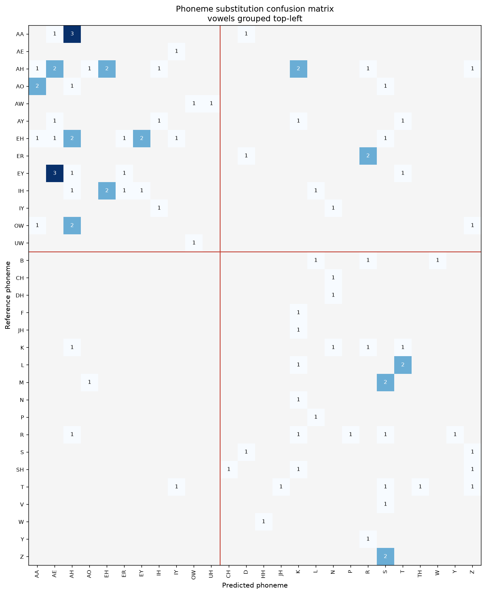

# Error pattern analysis: noise-augmented phoneme-to-text decoder

Project: homophone-aware phoneme-to-text decoding for lip-reading
Date: 23 July 2026
Model: Llama-3.2-3B with low-rank adapters, trained with noise-augmented phonemes
Decoding: beam search width 5
Evaluation set: 949 validation sentences, deduplicated against training

Structured to follow the P2T Three-Stage Error Analysis Framework. Read alongside
the clean-model report, since the purpose here is to show what noise-augmented
training changed about the character of the errors, beyond their count.

## Scope

This model was trained with half of its input phonemes deliberately corrupted, a
robustness technique measured separately in the noise-augmentation report. On
clean validation it gets 842 of 949 sentences exactly right and fails on 107,
against the clean-trained model's 873 right and 76 wrong. Every comparison below
uses the same 949 rows and the same beam-search decoding for both models, so the
differences are real properties of the two models rather than of the evaluation.

The failure sample is 107 rows, larger than the clean model's 76 but still small.
Several breakdowns rest on counts in single digits, and those are flagged where
they occur.

## Stage 1: Conventional evaluation

| Metric | Clean-trained | Noise-trained | Change |
|---|---|---|---|
| Phoneme error rate | 1.75% | 2.26% | ×1.29 |
| Word error rate | 2.09% | 2.92% | ×1.39 |
| Character error rate | 0.98% | 1.60% | ×1.64 |
| Exact sentence match | 92.0% | 88.7% | −3.3 points |

The noise-trained model is worse on every conventional metric, which is the
clean-input cost of the robustness it gains. One pattern is worth carrying
forward: the degradation is not uniform across the three error rates. Character
error rate rises the most, word error rate less, and phoneme error rate least. As
the measurement moves from the sound level up to the character level, the noise
model looks progressively worse relative to the clean one.

The framework's point about Stage 1 is that these numbers say how much and stay
silent on what. A character error rate that climbs faster than the phoneme error
rate hints that the noise model's wrong words are spelled further from the target,
but Stage 1 cannot say whether that comes from wrong words, added material, or a
different kind of confusion. Stage 2 answers that.

## Stage 2: Phoneme error pattern analysis

### Substitution, insertion and deletion

| Count | Clean-trained | Noise-trained | Change |
|---|---|---|---|
| Word substitutions | 87 | 120 | ×1.4 |
| Word insertions | 13 | 25 | ×1.9 |
| Word deletions | 11 | 7 | ×0.6 |
| Character substitutions | 116 | 161 | ×1.4 |
| Character insertions | 67 | 146 | ×2.2 |
| Character deletions | 78 | 110 | ×1.4 |

This resolves the Stage 1 hint. Character insertions more than doubled, while
substitutions and deletions grew only about 1.4 times. That single row is what
drove the disproportionate character error rate. The noise model's extra damage
is added material, characters and words that the target does not contain, more
than it is wrong words swapped one for one. Word deletions actually fell, so the
model adds rather than drops.

### Confusion matrix

The confusion matrix records, for every sound the model got wrong, which sound it
produced instead. Reference sounds run down the rows and predicted sounds across
the columns, with vowels grouped in the upper-left block.

| | Clean-trained | Noise-trained |
|---|---|---|
| Phoneme substitutions | 38 | 97 |
| Distinct confusion pairs | 36 | 81 |
| Repeated pairs | 2 | 14 |
| Vowel-to-vowel share | 50% | 43% |

Two changes in the shape of the errors, beyond the higher count.

The errors became more systematic. The clean model repeated almost no confusion,
2 of its 36 pairs. The noise model repeats 14, led by AA becoming AH three times
and EY becoming AE three times, with a cluster of AH confusions behind them. Noise
training concentrated the errors onto a recurring set of vowel confusions rather
than scattering them across single events. The most-substituted sound is now AH
with 11 substitutions, against 2 in the clean model.

The errors also stay vowel-dominated. Vowel-to-vowel substitutions are 42 of the
97, the largest single group, the same weak spot the clean model showed. Even the
sounds that fail most often fail toward a neighbouring vowel.

### Phoneme-class analysis

Substitution counts and corpus-wide rates for the most-substituted sounds:

| Sound | Substitutions | Occurrences across 949 sentences | Rate |
|---|---|---|---|
| AH (as in "cup") | 11 | 1,702 | 0.6% |
| EH (as in "bed") | 9 | 519 | 1.7% |
| IH (as in "sit") | 6 | 1,138 | 0.5% |
| EY (as in "say") | 6 | 263 | 2.3% |
| T | 5 | 1,540 | 0.3% |
| R | 5 | 829 | 0.6% |
| AA (as in "father") | 5 | 379 | 1.3% |

Every rate stays low, under 2.3%, which is expected for a model that gets 89% of
sentences exactly right. The most-substituted sounds are vowels, and the highest
rates belong to open and open-mid vowels, the same finding as the clean model but
on more errors so the pattern is better supported here.

Grouping substitutions by articulatory feature, where place is where in the mouth
a sound forms, manner is how it is produced, and voicing is whether the vocal
cords vibrate:

| Feature preserved | Clean-trained | Noise-trained |
|---|---|---|
| Place | 45% | 46% |
| Manner | 47% | 51% |
| Voicing | 26% | 33% |

The noise model preserves each feature slightly more often, which is the feature
view of the errors being more phonetically close.

### Are the errors systematic?

Weighting the phoneme error rate by articulatory similarity tests whether the
errors cluster among neighbouring sounds. A weighted rate far below the unweighted
one would mean near misses a sound-aware correction could repair.

| | Clean-trained | Noise-trained |
|---|---|---|
| Weighted-over-raw ratio | 0.93 | 0.87 |

The noise model's ratio is lower, so weighting by similarity discounts its errors
more. Its substitutions sit nearer the correct sound than the clean model's did.
This moves the noise model toward what the parallel prompting study found and away
from the clean model's scattered profile. Combined with the 14 repeated pairs, the
picture is consistent: noise training made the sound-level errors both closer and
more repeated, the two marks of a more systematic error pattern.

## Stage 3: Hierarchical error analysis

Stage 3 was carried out through four of the framework's five options. Option 1 is
manual annotation, Option 2 dictionary-based homophone detection, Option 3
grammar analysis, and Option 4 semantic similarity. Option 5, classification by a
language model, was not run; it needs a capable instruct-tuned judge model.

### 3.1 Lexical analysis (Option 1, manual annotation)

Each failing prediction was annotated against the framework's five categories:
Homophone, Lexical (wrong word selection), Contextual (grammatically
inappropriate), Semantic (meaning changed), and Other (uncategorised).

| Error type | Clean-trained | Noise-trained |
|---|---|---|
| Other | 50 (65.8%) | 49 (45.8%) |
| Lexical | 15 (19.7%) | 35 (32.7%) |
| Homophone | 6 (7.9%) | 11 (10.3%) |
| Contextual | 5 (6.6%) | 10 (9.3%) |
| Semantic | 0 (0.0%) | 2 (1.9%) |
| Total | 76 | 107 |

This is the central finding of the whole comparison, and it is clearest in the
absolute counts. The Other category, which holds non-words, mangled proper nouns,
boundary splits and number formatting, is almost identical between the two models,
50 against 49. Noise training added no garbled output. Every one of the 31 extra
failures it introduced landed in the linguistic categories, and 20 of those 31 are
Lexical, wrong but real words.

So the two models fail on the same hard cases in the same way, the roughly 50
proper nouns and rare words and formatting quirks that neither can handle. The
cost of noise training is specifically that it made the model produce more
confident wrong real words on clean input. Trained to recover a valid word from
corrupted phonemes, it sometimes commits to a plausible but incorrect word when
the input is clean, where the clean model would have produced the same garble or
gotten it right. This matches Stage 2 exactly: the sound-level errors got more
real-word-like, and here at the word level they show up as Lexical rather than
Other.

The dictionary method in the next section could only detect homophones, lumping
everything else into one bucket. This manual annotation is what separates the
linguistic error types, which is its purpose in the framework.

### 3.2 Contextual analysis (Options 2 and 3)

Option 2, dictionary-based lexical analysis, looks every word substitution up in
the CMU pronouncing dictionary and labels it a homophone when the two words share
an identical pronunciation. It found 6 of 120 word substitutions (5.0%) are exact
homophones: khan to con, baron to barron, knot to not, to to two, lloyd to loyd,
and by to buy. True homophones are a small fraction, the same finding as every
run. This strict count is lower than the manual annotation's 11, because the
manual pass also caught near-identical sound-alikes the dictionary does not treat
as exact matches.

Option 3, grammar-based context analysis, used spaCy to detect tense, agreement
and word-order errors. LanguageTool, the framework's other named tool, needs a
Java runtime that is not installed, so spaCy was used, which the framework lists
as an accepted alternative. It flagged 9 of 107 failing sentences: 4 tense (face
to faced, unfold to unfolded), 3 article or auxiliary (through antibody to through
an antibody), and 2 agreement (upset to upsets, rocket to rockets). Grammar is a
minor error source and the predictions are mostly well-formed, the same as the
clean model.

### 3.3 Semantic analysis (Option 4)

Semantic similarity was measured two ways. The token-level method (BERTScore) was
run first, then the framework's literal method, sentence embeddings with a cosine
similarity, which encodes each sentence to one vector.

| Method | Mean | ≥ 0.90 | < 0.50 |
|---|---|---|---|
| BERTScore (token-level) | 0.877 | 42% | 0% |
| Sentence embeddings (framework's method) | 0.674 | 18% | 19% |

The two methods disagree substantially, and the exact one is more discriminating.
BERTScore reported that nothing fell below 0.50, so meaning looked fully preserved.
Sentence embeddings put 19% of failures below 0.50. The extremes confirm the
sentence-embedding method reads meaning correctly: its lowest scores are genuine
meaning losses (ISLAM ALLOWS POLYGAMY becoming EL SALVADOR LOWS POLICY at 0.02),
and its highest are the cases where meaning truly survives (SIX becoming 6, the
article insertion, the agreement fix, all above 0.97). This is the framework's own
Option 4 warning confirmed on real data: a token-overlap score stays high while
meaning changes.

Comparing the two models on the exact method:

| Sentence-embedding cosine | Clean-trained | Noise-trained |
|---|---|---|
| Mean | 0.662 | 0.674 |
| < 0.50 (meaning lost) | 22% | 19% |

The two models' failures are about equal in meaning quality. The noise model's
mean is marginally higher and its share of meaning-lost failures marginally lower,
so per failure it preserves meaning about as well as the clean model. Its semantic
cost sits in the count of failures: both models lose meaning on about a fifth of
their failures, but the noise model has more failures, so in absolute terms it
produces 20 meaning-lost sentences against the clean model's 17.

### 3.4 Severity assessment

Severity was assigned by meaning impact, using the per-row sentence-embedding
scores, since the framework defines severity by consequence and a semantic score
measures exactly that. Bands: Low is a score at or above 0.90 (meaning preserved),
Medium is 0.70 to 0.90 (minor drift), High is 0.50 to 0.70 (substantial change),
and meaning-lost is below 0.50.

| Severity | Clean-trained | Noise-trained |
|---|---|---|
| Low | 24% | 18% |
| Medium | 18% | 30% |
| High | 36% | 34% |
| Meaning lost | 22% | 19% |

Both models carry substantial High and meaning-lost mass, roughly half of each
model's failures. The two distributions are close, consistent with 3.3: per
failure the two models are about equally severe, and the noise model's cost is the
larger number of failures. A caution the framework itself raises applies here: a
similarity score cannot detect a fluent meaning reversal, so this method cannot
rule out the framework's true Critical category on its own, and severity in a
safety-critical deployment would need human review. This corpus is broadcast
television with no safety-consequential output.

An earlier severity table built on BERTScore was far more lenient, putting almost
everything at Low or Medium. That was an artifact of the token-level method
overstating meaning preservation, corrected here by the exact method.

## Framework option coverage

| Stage 3 option | Status for this model |
|---|---|
| 1. Manual annotation | Done, all 107 failures annotated |
| 2. Dictionary homophone | Done |
| 3. Grammar context (spaCy) | Done |
| 4. Semantic similarity (sentence embeddings) | Done |
| 5. LLM classification | Not run, needs a capable judge model |

## Correction recommendations

The noise model's failures point to the same fixes as the clean model, with one
shift in emphasis. Because noise training moved errors from garble toward wrong
real words, constraining generation to real words would help less here than it
would for the clean model; the wrong words are already real. The open-vowel
confusion is more pronounced and more repeated, so it is the clearer target.

| Rank | Issue | Direction |
|---|---|---|
| 1 | Open-vowel confusion, now repeated (AA, EH, EY) | Needs acoustic-side work; not addressable at the text stage |
| 2 | Wrong real-word substitutions (Lexical, 33% of failures) | A stronger language-model prior or context rescoring |
| 3 | Word segmentation and boundary errors | Handle compounds on the target side, or penalise mid-word spaces |
| 4 | Rare and proper nouns | Extend dictionary coverage |
| 5 | Number formatting | Normalise digits and number words before scoring |

## Caveats

The failure sample is 107 rows, and several tables rest on counts below ten.

The manual annotation was done by reading each pair and assigning one dominant
category, using a fixed precedence saved with the results. The annotator was an
automated reader rather than a human, which sits between the framework's Option 1
and its Option 5, and the boundaries between Lexical, Homophone and Semantic are
fuzzy on a handful of rows. A human pass could shift the borderline calls.

Sentence-embedding cosine runs on a different scale from BERTScore F1, and short
sentences pull it down, so the band cutoffs are not absolute. The reliable signals
are the relative comparison between the two models, which is near-parity, and the
verified extremes.

The corpus carries no speaker identifiers, so the same speakers may appear in
training and evaluation. If they do, scores are optimistic by an unknown amount.

All numbers come from the validation split. The held-out 1,243-row test set
remains untouched and available for final reporting.

## Reproduction

Derived from the beam-5 predictions on the 949-row deduplicated validation set, in
this directory. Stage tables are `summary.json`, `stage2_confusion_pairs.csv`,
`stage2_per_phoneme.csv`, and the Stage 3 option files. Semantic scoring used
BERTScore with DeBERTa-base-MNLI and sentence embeddings with all-MiniLM-L6-v2.
Grammar analysis used spaCy en_core_web_sm. No GPU required for any analysis step.
